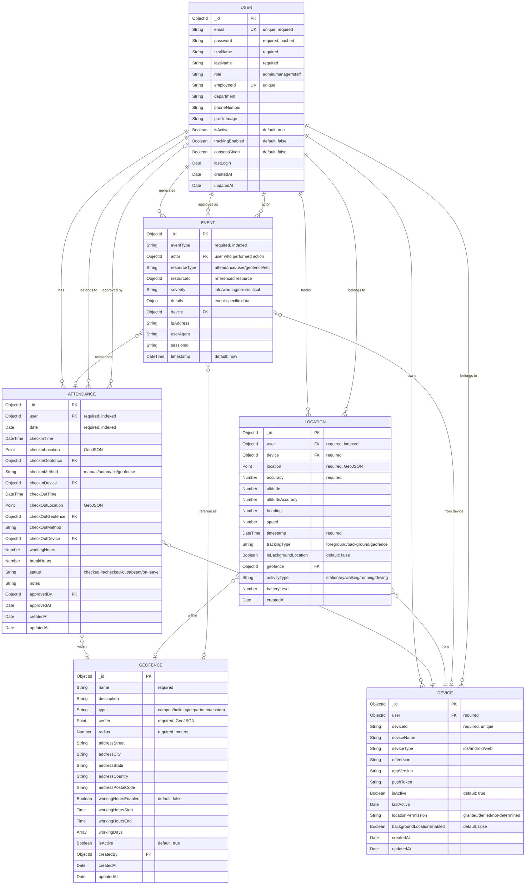

# Auto-Attendance Tracking System - Technical Diagrams

## 7.1 Class Diagram

```mermaid
classDiagram
    %% Controllers Layer
    class AuthController {
        +register(req, res)
        +login(req, res)
        +logout(req, res)
        +forgotPassword(req, res)
        +resetPassword(req, res)
        +updatePassword(req, res)
        +verifyToken(req, res)
    }

    class AttendanceController {
        +checkIn(req, res)
        +checkOut(req, res)
        +getTodayAttendance(req, res)
        +getUserAttendance(req, res)
        +getAllAttendance(req, res)
        +updateAttendance(req, res)
        +deleteAttendance(req, res)
        +getAttendanceStats(req, res)
    }

    class UserController {
        +getProfile(req, res)
        +updateProfile(req, res)
        +uploadProfilePicture(req, res)
        +getAllUsers(req, res)
        +getUserById(req, res)
        +updateUser(req, res)
        +deleteUser(req, res)
        +createUser(req, res)
    }

    class GeofenceController {
        +createGeofence(req, res)
        +getAllGeofences(req, res)
        +getGeofenceById(req, res)
        +updateGeofence(req, res)
        +deleteGeofence(req, res)
        +checkUserInGeofence(req, res)
    }

    class LocationController {
        +recordLocation(req, res)
        +getUserLocations(req, res)
        +getLocationHistory(req, res)
        +deleteUserLocations(req, res)
    }

    class DashboardController {
        +getDashboardStats(req, res)
        +getAttendanceOverview(req, res)
        +getDepartmentStats(req, res)
        +getTodayOverview(req, res)
    }

    class ReportController {
        +generateReport(req, res)
        +exportReport(req, res)
        +getReportTypes(req, res)
        +scheduleReport(req, res)
    }

    %% Services Layer
    class AuthService {
        +registerUser(userData)
        +authenticateUser(email, password)
        +generateToken(userId)
        +verifyToken(token)
        +hashPassword(password)
        +comparePassword(password, hash)
    }

    class AttendanceService {
        +processCheckIn(userId, location, device)
        +processCheckOut(userId, location, device)
        +calculateWorkingHours(attendance)
        +getAttendanceByDateRange(userId, startDate, endDate)
        +getAttendanceStats(userId)
        +detectAnomalies(attendance)
    }

    class GeofenceService {
        +createGeofence(data)
        +checkPointInGeofence(point, geofence)
        +findGeofencesContainingPoint(point)
        +validateGeofenceRules(geofence)
        +notifyGeofenceEvent(event)
    }

    class LocationService {
        +recordLocation(userId, deviceId, coordinates)
        +getLocationHistory(userId, dateRange)
        +validateLocation(location)
        +calculateDistance(point1, point2)
        +detectLocationTampering(locations)
    }

    class EmailService {
        +sendEmail(to, subject, content)
        +sendPasswordResetEmail(user, token)
        +sendWelcomeEmail(user)
        +sendAttendanceAlert(user, details)
    }

    class ExportService {
        +exportToExcel(data, format)
        +exportToPDF(data, template)
        +exportToCSV(data)
        +generateReport(reportType, filters)
    }

    class CacheService {
        +get(key)
        +set(key, value, ttl)
        +delete(key)
        +clear(pattern)
    }

    class AnalyticsService {
        +trackEvent(eventType, data)
        +getAttendanceAnalytics(filters)
        +getUserBehaviorAnalytics(userId)
        +generateInsights(data)
    }

    %% Models Layer
    class User {
        +String email
        +String password
        +String firstName
        +String lastName
        +String role
        +String employeeId
        +String department
        +String phoneNumber
        +String profileImage
        +Boolean isActive
        +Boolean trackingEnabled
        +Boolean consentGiven
        +Date createdAt
        +comparePassword(password)
        +generateAuthToken()
        +getPublicProfile()
    }

    class Attendance {
        +ObjectId user
        +Date date
        +Object checkIn
        +Object checkOut
        +Number workingHours
        +Number breakHours
        +String status
        +ObjectId approvedBy
        +Date createdAt
        +calculateWorkingHours()
        +isLate()
        +isEarlyLeave()
    }

    class Device {
        +ObjectId user
        +String deviceId
        +String deviceName
        +String deviceType
        +String osVersion
        +String appVersion
        +String pushToken
        +Boolean isActive
        +Date lastActive
        +String locationPermission
        +Boolean backgroundLocationEnabled
        +updateLastActive()
        +deactivate()
    }

    class Geofence {
        +String name
        +String description
        +String type
        +Object center
        +Number radius
        +Object address
        +Object workingHours
        +Boolean isActive
        +Date createdAt
        +containsPoint(point)
        +isWithinWorkingHours()
        +getDistance(point)
    }

    class Location {
        +ObjectId user
        +ObjectId device
        +Object location
        +Number accuracy
        +Number altitude
        +Date timestamp
        +String trackingType
        +Boolean isBackgroundLocation
        +ObjectId geofence
        +Date createdAt
        +validateAccuracy()
        +isValid()
    }

    class Event {
        +String eventType
        +ObjectId actor
        +Object resource
        +String severity
        +Object details
        +ObjectId device
        +String ipAddress
        +String userAgent
        +Date timestamp
        +log(eventData)
        +getEventsByType(type)
    }

    %% Middleware
    class AuthMiddleware {
        +protect(req, res, next)
        +authorize(...roles)
        +verifyToken(token)
        +checkPermission(permission)
    }

    class ValidationMiddleware {
        +validateBody(schema)
        +validateParams(schema)
        +validateQuery(schema)
        +sanitizeInput(data)
    }

    class RateLimiter {
        +limitRequests(options)
        +checkLimit(key)
        +resetLimit(key)
    }

    class ErrorHandler {
        +handleError(err, req, res, next)
        +asyncHandler(fn)
        +notFound(req, res, next)
    }

    %% Relationships
    AuthController --> AuthService : uses
    AttendanceController --> AttendanceService : uses
    UserController --> User : manages
    GeofenceController --> GeofenceService : uses
    LocationController --> LocationService : uses
    ReportController --> ExportService : uses
    DashboardController --> AnalyticsService : uses

    AttendanceService --> Attendance : operates on
    AttendanceService --> Location : queries
    AttendanceService --> Geofence : validates with
    
    GeofenceService --> Geofence : manages
    LocationService --> Location : manages
    AuthService --> User : authenticates
    
    User "1" --> "*" Attendance : has
    User "1" --> "*" Device : owns
    User "1" --> "*" Location : tracks
    User "1" --> "*" Event : generates
    
    Attendance "*" --> "1" User : belongs to
    Attendance "*" --> "0..1" Geofence : within
    Attendance "*" --> "1" Device : recorded by
    
    Location "*" --> "1" User : belongs to
    Location "*" --> "1" Device : from
    Location "*" --> "0..1" Geofence : within
    
    Device "*" --> "1" User : belongs to
    
    Event "*" --> "1" User : actor
    Event "*" --> "0..1" Device : from
    
    AttendanceService --> EmailService : notifies via
    AttendanceService --> CacheService : caches with
    GeofenceService --> AnalyticsService : tracks with
```

---

## 7.2 Data Flow Diagram

```mermaid
graph TB
    %% External Entities
    MobileApp[Mobile App<br/>iOS/Android]
    WebApp[Web Application<br/>Admin Dashboard]
    User[User/Employee]
    Admin[Administrator]
    Manager[Manager]

    %% Main Processes
    Auth[Authentication<br/>Process]
    CheckIn[Check-In<br/>Process]
    CheckOut[Check-Out<br/>Process]
    LocationTrack[Location Tracking<br/>Process]
    GeofenceMonitor[Geofence Monitoring<br/>Process]
    ReportGen[Report Generation<br/>Process]
    Dashboard[Dashboard<br/>Analytics Process]
    UserMgmt[User Management<br/>Process]

    %% Data Stores
    UserDB[(User<br/>Database)]
    AttendanceDB[(Attendance<br/>Database)]
    LocationDB[(Location<br/>Database)]
    GeofenceDB[(Geofence<br/>Database)]
    DeviceDB[(Device<br/>Database)]
    EventDB[(Event Log<br/>Database)]
    Cache[(Redis<br/>Cache)]

    %% Background Services
    EmailSvc[Email Service]
    NotifSvc[Notification Service]
    AnalyticsSvc[Analytics Service]
    ExportSvc[Export Service]

    %% Authentication Flow
    User -->|Login Credentials| MobileApp
    Admin -->|Login Credentials| WebApp
    MobileApp -->|Auth Request| Auth
    WebApp -->|Auth Request| Auth
    Auth -->|Validate User| UserDB
    UserDB -->|User Data| Auth
    Auth -->|JWT Token| MobileApp
    Auth -->|JWT Token| WebApp
    Auth -->|Log Event| EventDB

    %% Check-In Flow
    User -->|Check-In Action| MobileApp
    MobileApp -->|Location + Device Info| CheckIn
    CheckIn -->|Verify Device| DeviceDB
    CheckIn -->|Check Geofence| GeofenceMonitor
    GeofenceMonitor -->|Query Geofences| GeofenceDB
    GeofenceDB -->|Matching Geofences| GeofenceMonitor
    GeofenceMonitor -->|Validation Result| CheckIn
    CheckIn -->|Create/Update Record| AttendanceDB
    CheckIn -->|Save Location| LocationDB
    CheckIn -->|Log Event| EventDB
    CheckIn -->|Success Response| MobileApp
    CheckIn -->|Send Notification| NotifSvc
    CheckIn -->|Cache Stats| Cache

    %% Check-Out Flow
    User -->|Check-Out Action| MobileApp
    MobileApp -->|Location + Time| CheckOut
    CheckOut -->|Fetch Check-In| AttendanceDB
    AttendanceDB -->|Attendance Record| CheckOut
    CheckOut -->|Calculate Hours| CheckOut
    CheckOut -->|Update Record| AttendanceDB
    CheckOut -->|Save Location| LocationDB
    CheckOut -->|Log Event| EventDB
    CheckOut -->|Success Response| MobileApp
    CheckOut -->|Update Cache| Cache

    %% Location Tracking Flow
    MobileApp -->|GPS Coordinates| LocationTrack
    LocationTrack -->|Validate Location| LocationTrack
    LocationTrack -->|Store Location| LocationDB
    LocationTrack -->|Check Boundaries| GeofenceMonitor
    GeofenceMonitor -->|Geofence Event| EventDB
    LocationTrack -->|Track Analytics| AnalyticsSvc

    %% Geofence Monitoring
    GeofenceMonitor -->|Entry/Exit Events| NotifSvc
    GeofenceMonitor -->|Violation Detection| EmailSvc
    GeofenceMonitor -->|Analytics Data| AnalyticsSvc

    %% Dashboard Flow
    Manager -->|View Dashboard| WebApp
    Admin -->|View Dashboard| WebApp
    WebApp -->|Request Stats| Dashboard
    Dashboard -->|Check Cache| Cache
    Cache -.->|Cache Hit| Dashboard
    Dashboard -->|Query Data| AttendanceDB
    Dashboard -->|Query Data| UserDB
    Dashboard -->|Query Data| LocationDB
    AttendanceDB -->|Aggregated Data| Dashboard
    UserDB -->|User Stats| Dashboard
    LocationDB -->|Location Stats| Dashboard
    Dashboard -->|Update Cache| Cache
    Dashboard -->|Display Data| WebApp
    Dashboard -->|Log Activity| EventDB

    %% User Management Flow
    Admin -->|Manage Users| WebApp
    WebApp -->|CRUD Operations| UserMgmt
    UserMgmt -->|Query/Update| UserDB
    UserMgmt -->|Update Devices| DeviceDB
    UserMgmt -->|Send Welcome Email| EmailSvc
    UserMgmt -->|Log Changes| EventDB
    UserDB -->|User List| WebApp

    %% Report Generation Flow
    Manager -->|Request Report| WebApp
    Admin -->|Request Report| WebApp
    WebApp -->|Report Parameters| ReportGen
    ReportGen -->|Query Attendance| AttendanceDB
    ReportGen -->|Query Users| UserDB
    ReportGen -->|Query Locations| LocationDB
    AttendanceDB -->|Attendance Data| ReportGen
    UserDB -->|User Data| ReportGen
    LocationDB -->|Location Data| ReportGen
    ReportGen -->|Format Data| ExportSvc
    ExportSvc -->|Generate File| ReportGen
    ReportGen -->|Download Link| WebApp
    ReportGen -->|Email Report| EmailSvc
    ReportGen -->|Log Export| EventDB

    %% Background Analytics
    AnalyticsSvc -->|Analyze Patterns| AttendanceDB
    AnalyticsSvc -->|Store Insights| Cache
    AnalyticsSvc -->|Generate Alerts| NotifSvc

    %% Notification Services
    NotifSvc -->|Push Notifications| MobileApp
    NotifSvc -->|Browser Notifications| WebApp
    EmailSvc -->|Send Emails| Admin
    EmailSvc -->|Send Emails| Manager
    EmailSvc -->|Send Emails| User

    %% Styling
    classDef external fill:#e1f5ff,stroke:#01579b,stroke-width:2px
    classDef process fill:#fff9c4,stroke:#f57f17,stroke-width:2px
    classDef datastore fill:#f3e5f5,stroke:#4a148c,stroke-width:2px
    classDef service fill:#e8f5e9,stroke:#1b5e20,stroke-width:2px

    class User,Admin,Manager,MobileApp,WebApp external
    class Auth,CheckIn,CheckOut,LocationTrack,GeofenceMonitor,ReportGen,Dashboard,UserMgmt process
    class UserDB,AttendanceDB,LocationDB,GeofenceDB,DeviceDB,EventDB,Cache datastore
    class EmailSvc,NotifSvc,AnalyticsSvc,ExportSvc service
```

---

## 7.3 Entity Relationship Diagram

---

## Diagram Descriptions

### 7.1 Class Diagram
The class diagram shows the object-oriented structure of the system with three main layers:
- **Controllers Layer**: Handles HTTP requests and responses
- **Services Layer**: Contains business logic and data processing
- **Models Layer**: Represents database entities with methods
- **Middleware**: Provides cross-cutting concerns like authentication and validation

### 7.2 Data Flow Diagram (DFD)
The DFD illustrates how data flows through the system:
- **External Entities**: Users, Mobile App, Web App, Administrators
- **Processes**: Authentication, Check-in/out, Location Tracking, Reporting
- **Data Stores**: User, Attendance, Location, Geofence, Device, Event databases
- **Services**: Email, Notification, Analytics, Export services

### 7.3 Entity Relationship Diagram (ERD)
The ERD displays database schema with:
- **Entities**: User, Attendance, Device, Geofence, Location, Event
- **Relationships**: One-to-many and many-to-one relationships between entities
- **Attributes**: All fields with data types, constraints, and keys
- **Cardinality**: How entities relate to each other

---

## Notes for Screenshots

1. **GitHub/GitLab Rendering**: These diagrams use Mermaid syntax and will render automatically on GitHub, GitLab, and many markdown viewers.

2. **VS Code Rendering**: Install the "Markdown Preview Mermaid Support" extension to view these diagrams in VS Code.

3. **Online Rendering**: You can also view these diagrams at:
   - https://mermaid.live/
   - https://mermaid-js.github.io/mermaid-live-editor/

4. **Export Options**:
   - Use GitHub's markdown preview and take screenshots
   - Use mermaid.live to export as PNG/SVG
   - Use VS Code with Mermaid extensions to export diagrams

5. **Customization**: You can modify colors, styles, and layout by editing the Mermaid syntax.

---

**Created**: December 2025  
**Version**: 1.0  
**Project**: Auto-Attendance Tracking System
