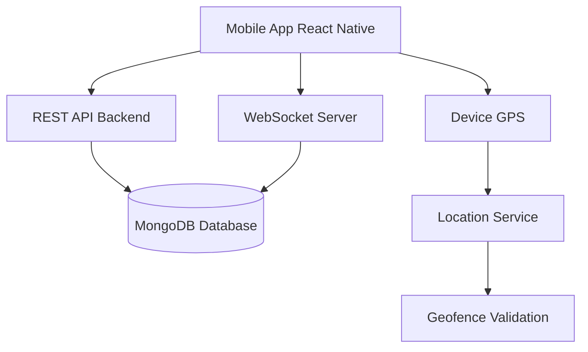
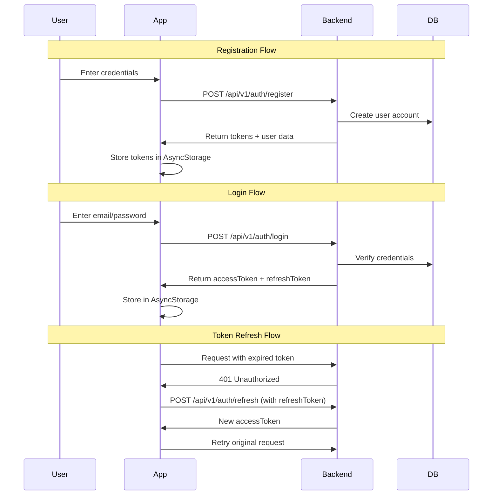
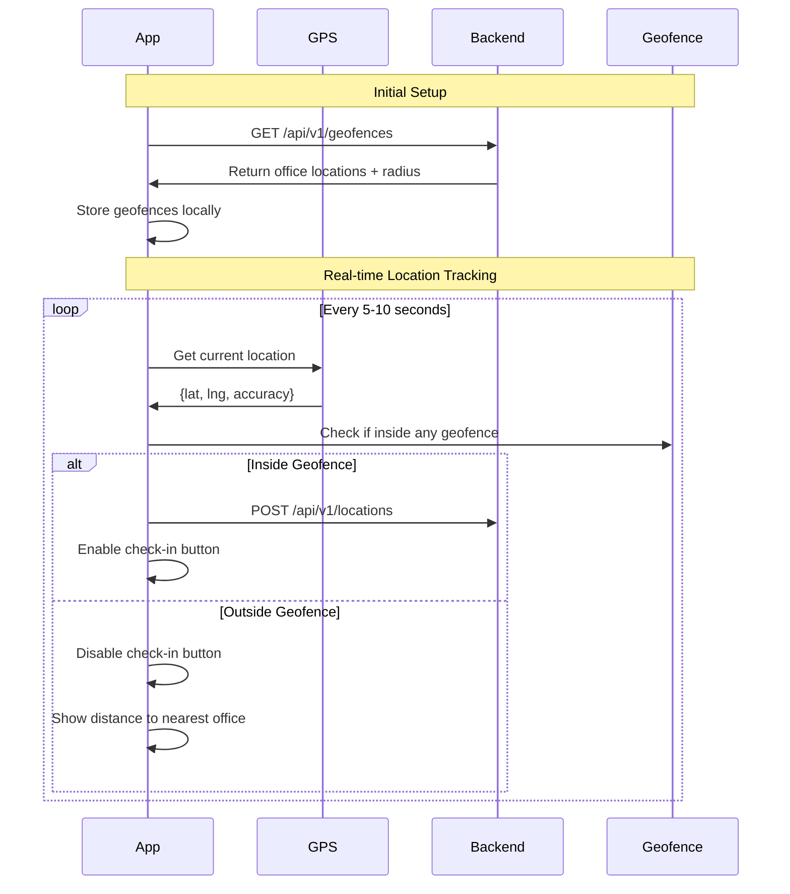
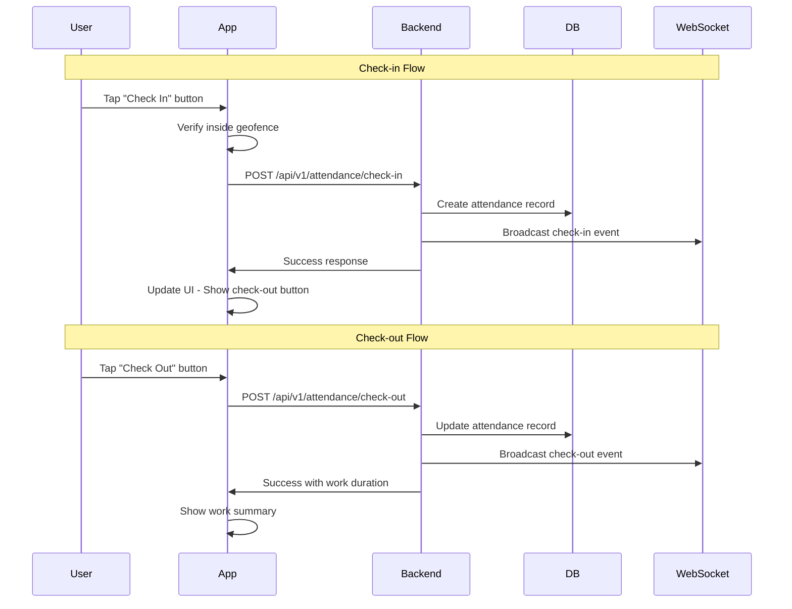
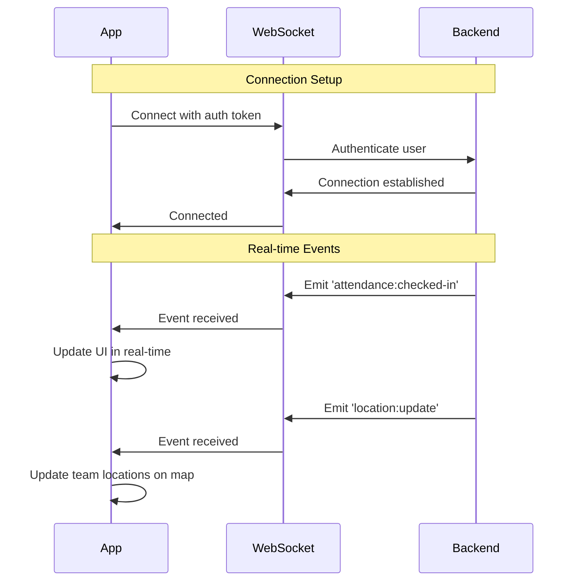

# Frontend Development Guide
## Auto Attendance Tracking System

This guide explains the backend logic and flows to help frontend developers build the mobile application.

---

## 🏗️ System Architecture



---

## 🔐 1. Authentication Flow



### API Endpoints:
- **POST** `/api/v1/auth/register` - Register new user
- **POST** `/api/v1/auth/login` - Login user
- **POST** `/api/v1/auth/refresh` - Refresh access token
- **POST** `/api/v1/auth/logout` - Logout user

### Required Screens:
1. **Login Screen** - Email, password, "Forgot Password" link
2. **Register Screen** - Name, email, password, role selection
3. **Forgot Password Screen** - Password recovery

---

## 📍 2. Location & Geofencing Flow



### Geofence Logic:
```javascript
// Distance calculation (Haversine formula)
function isInsideGeofence(userLat, userLng, geofenceLat, geofenceLng, radius) {
  const distance = calculateDistance(userLat, userLng, geofenceLat, geofenceLng);
  return distance <= radius; // radius in meters
}

// User can only check-in if inside geofence
if (isInsideGeofence) {
  enableCheckInButton();
} else {
  showDistanceToOffice();
}
```

### API Endpoints:
- **GET** `/api/v1/geofences` - Get all office locations
- **POST** `/api/v1/geofences` - Create geofence (Admin only)
- **POST** `/api/v1/locations` - Send location updates

### Required Screens:
1. **Map Screen** - Show user location + geofences
2. **Location Permission Screen** - Request GPS permissions

---

## ✅ 3. Attendance Check-in/Check-out Flow



### Business Rules:
1. **Check-in** only allowed if:
   - Inside geofence
   - No active attendance record
   - User is authenticated

2. **Check-out** only allowed if:
   - User has checked in
   - Same day as check-in

3. **Auto Check-out**:
   - System auto checks-out at midnight if user forgets

### API Endpoints:
- **POST** `/api/v1/attendance/check-in` - Check in
- **POST** `/api/v1/attendance/check-out` - Check out
- **GET** `/api/v1/attendance/status` - Get current status
- **GET** `/api/v1/attendance/history` - Get attendance history
- **GET** `/api/v1/attendance/stats` - Get statistics

### Required Screens:
1. **Home/Dashboard Screen** - Show check-in/out buttons + current status
2. **Attendance History Screen** - List of past attendance
3. **Statistics Screen** - Charts, graphs, work hours

---

## 🔄 4. WebSocket Real-time Updates



### WebSocket Events:
**Listen to (from server):**
- `attendance:checked-in` - When user checks in
- `attendance:checked-out` - When user checks out
- `location:update` - Team member location updates
- `geofence:entered` - User entered geofence
- `geofence:exited` - User left geofence

**Emit to (to server):**
- `location:track` - Send location updates
- `attendance:request-status` - Request current status

---

## 📊 5. Complete Screen Structure

### 📱 Screen Hierarchy:

```
App
├── Auth Stack (Not Logged In)
│   ├── Login
│   ├── Register
│   └── Forgot Password
│
└── Main Stack (Logged In)
    ├── Home/Dashboard
    │   ├── Check-in/Check-out buttons
    │   ├── Current status
    │   └── Today's work hours
    │
    ├── Map View
    │   ├── User current location
    │   ├── Office geofences
    │   └── Team members (if admin)
    │
    ├── Attendance
    │   ├── History List
    │   ├── Calendar View
    │   └── Details/Edit
    │
    ├── Statistics
    │   ├── Charts (daily/weekly/monthly)
    │   ├── Total hours
    │   └── Punctuality stats
    │
    └── Profile
        ├── User info
        ├── Settings
        └── Logout
```

---

## 🎨 6. UI/UX Recommendations

### Home Screen (Dashboard):
```
┌─────────────────────────────────┐
│  Good Morning, John! 👋         │
│                                  │
│  ┌──────────────────────────┐  │
│  │   📍 Location Status      │  │
│  │   ✅ Inside Office        │  │
│  │   Distance: 0 meters      │  │
│  └──────────────────────────┘  │
│                                  │
│  ┌──────────────────────────┐  │
│  │   [CHECK IN] 🕐          │  │ <- Big green button
│  └──────────────────────────┘  │
│                                  │
│  Today's Activity:               │
│  ⏰ Not checked in yet          │
│                                  │
│  This Week: 32h 45m              │
│  ───────────────────────────     │
│  📊 View History  🗺️ Map View   │
└─────────────────────────────────┘
```

### After Check-in:
```
┌─────────────────────────────────┐
│  Currently Working ⚡            │
│                                  │
│  ⏱️ Time Working:                │
│     2h 34m 18s                   │
│                                  │
│  ┌──────────────────────────┐  │
│  │   [CHECK OUT] 🏁         │  │ <- Red button
│  └──────────────────────────┘  │
│                                  │
│  Checked in at: 9:15 AM          │
│  📍 Office HQ                    │
└─────────────────────────────────┘
```

---

## 🗂️ 7. Data Models

### User Object:
```javascript
{
  _id: "ObjectId",
  name: "John Doe",
  email: "john@example.com",
  role: "staff", // or "admin"
  department: "Engineering",
  deviceId: "unique-device-id",
  isActive: true,
  createdAt: "2025-01-01T00:00:00Z"
}
```

### Attendance Object:
```javascript
{
  _id: "ObjectId",
  userId: "ObjectId",
  checkInTime: "2025-12-12T09:15:00Z",
  checkOutTime: "2025-12-12T17:30:00Z",
  checkInLocation: {
    type: "Point",
    coordinates: [lng, lat]
  },
  checkOutLocation: {
    type: "Point",
    coordinates: [lng, lat]
  },
  workDuration: 8.25, // hours
  status: "completed", // "checked-in" | "completed"
  date: "2025-12-12"
}
```

### Geofence Object:
```javascript
{
  _id: "ObjectId",
  name: "Office HQ",
  location: {
    type: "Point",
    coordinates: [lng, lat]
  },
  radius: 100, // meters
  address: "123 Main St",
  isActive: true
}
```

---

## 🔌 8. API Request Examples

### Check-in Request:
```javascript
POST /api/v1/attendance/check-in
Headers: {
  Authorization: "Bearer <accessToken>"
}
Body: {
  location: {
    latitude: 40.7128,
    longitude: -74.0060
  },
  deviceId: "unique-device-id"
}

Response: {
  success: true,
  data: {
    attendance: { ...attendanceObject },
    message: "Checked in successfully"
  }
}
```

### Get Attendance History:
```javascript
GET /api/v1/attendance/history?startDate=2025-12-01&endDate=2025-12-31
Headers: {
  Authorization: "Bearer <accessToken>"
}

Response: {
  success: true,
  data: {
    attendances: [...],
    totalRecords: 20,
    pagination: { page: 1, limit: 10, totalPages: 2 }
  }
}
```

---

## 🚨 9. Error Handling

### Common Error Codes:
```javascript
// 401 - Unauthorized
{
  success: false,
  error: {
    message: "Invalid or expired token",
    code: "UNAUTHORIZED"
  }
}

// 403 - Forbidden (Outside Geofence)
{
  success: false,
  error: {
    message: "You are not within office premises",
    code: "OUTSIDE_GEOFENCE",
    details: {
      distance: 250, // meters away
      nearestOffice: "Office HQ"
    }
  }
}

// 400 - Already Checked In
{
  success: false,
  error: {
    message: "You are already checked in",
    code: "ALREADY_CHECKED_IN",
    details: {
      checkInTime: "2025-12-12T09:15:00Z"
    }
  }
}
```

### Error Handling Strategy:
```javascript
try {
  const response = await api.post('/attendance/check-in', data);
  showSuccess("Checked in successfully!");
} catch (error) {
  if (error.response?.data?.error?.code === 'OUTSIDE_GEOFENCE') {
    showError(`You are ${error.response.data.error.details.distance}m away from office`);
  } else if (error.response?.data?.error?.code === 'ALREADY_CHECKED_IN') {
    showError("You are already checked in");
  } else {
    showError("Something went wrong. Please try again.");
  }
}
```

---

## ⚙️ 10. Background Services

### Location Tracking (Background):
```javascript
// Must continue even when app is closed
BackgroundFetch.registerTaskAsync('location-tracking', {
  minimumInterval: 15 * 60, // 15 minutes
  stopOnTerminate: false,
  startOnBoot: true,
});

// Send location updates periodically
TaskManager.defineTask('location-tracking', async () => {
  const location = await Location.getCurrentPositionAsync();
  await api.post('/locations', {
    latitude: location.coords.latitude,
    longitude: location.coords.longitude,
    accuracy: location.coords.accuracy,
  });
});
```

---

## 📝 11. Environment Variables

The mobile app needs these environment variables in `.env`:

```env
# Backend API URL
EXPO_PUBLIC_API_URL=http://192.168.0.105:5000/api/v1

# WebSocket URL
EXPO_PUBLIC_WS_URL=ws://192.168.0.105:5000

# Location tracking settings
EXPO_PUBLIC_LOCATION_UPDATE_INTERVAL=10000  # 10 seconds
EXPO_PUBLIC_LOCATION_DISTANCE_FILTER=10     # 10 meters
EXPO_PUBLIC_BACKGROUND_FETCH_INTERVAL=900   # 15 minutes
```

---

## 🎯 12. Development Priorities

### Phase 1 - Core Features:
1. ✅ Authentication (Login/Register)
2. ✅ Location permissions
3. ✅ Basic map view
4. ✅ Check-in/Check-out functionality

### Phase 2 - Enhanced Features:
5. ✅ Attendance history
6. ✅ Real-time location tracking
7. ✅ WebSocket integration
8. ✅ Background location updates

### Phase 3 - Analytics:
9. ✅ Statistics & charts
10. ✅ Reports generation
11. ✅ Admin dashboard (for admins)

---

## 🔧 13. Testing Checklist

- [ ] User can register and login
- [ ] Token refresh works automatically
- [ ] Location permissions requested properly
- [ ] User location displayed on map
- [ ] Geofences visible on map
- [ ] Check-in only works inside geofence
- [ ] Check-out works after check-in
- [ ] Can't check-in twice
- [ ] Attendance history loads correctly
- [ ] Statistics/charts display properly
- [ ] WebSocket connection established
- [ ] Real-time updates received
- [ ] Background location tracking works
- [ ] App works offline (shows cached data)
- [ ] Push notifications (if implemented)

---

## 📚 14. Useful Libraries

Already installed:
- `expo-location` - GPS tracking
- `react-native-maps` - Map display
- `socket.io-client` - WebSocket
- `@react-native-async-storage/async-storage` - Local storage
- `axios` - HTTP requests
- `expo-task-manager` - Background tasks
- `expo-background-fetch` - Background updates

---

## 🎓 15. Key Concepts to Understand

1. **Geofencing**: Circular areas around offices where check-in is allowed
2. **Token Refresh**: Automatic renewal of expired access tokens
3. **Background Location**: GPS tracking even when app is closed
4. **WebSocket**: Real-time bidirectional communication
5. **Optimistic UI**: Update UI before server response for better UX

---

## 📞 Backend API Documentation

Full API documentation available at: `docs/API.md`

Backend runs on: `http://localhost:5000` (development)

---

## 🚀 Quick Start for Frontend Dev

1. Install dependencies: `npm install`
2. Configure `.env` with backend URL
3. Start development: `npm start`
4. Test on device with Expo Go
5. Build screens in this order:
   - Login/Register → Home → Map → History → Stats

---

**Need help?** Check `docs/API.md` for detailed API documentation or contact the backend team!
